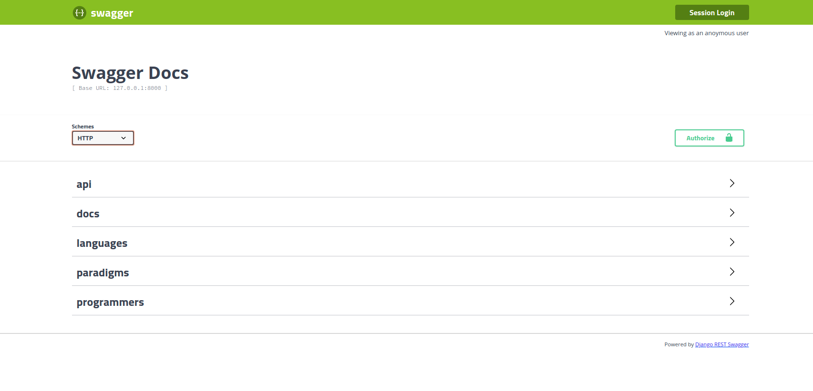
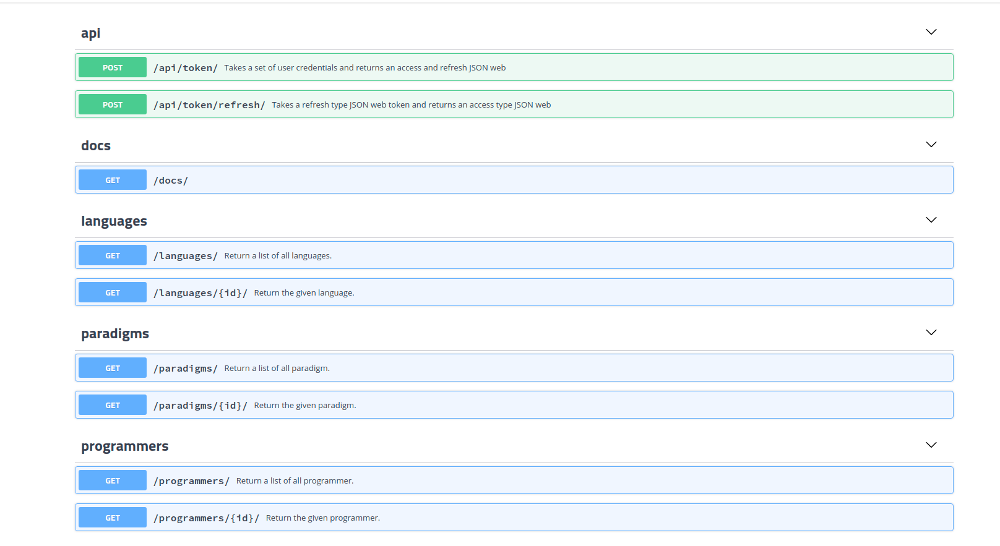

### Pre-reading

- [swagger.io](https://swagger.io/docs/specification/2-0/what-is-swagger/).


### Integration

1. Install rest swagger.

```
(tutorial) dev-mentor@devmentor-PC-MK34LEZCBEAD:~/Downloads/django-restframework$ pipenv install django-rest-swagger
Installing django-rest-swagger…
Adding django-rest-swagger to Pipfile's [packages]…
✔ Installation Succeeded 
Pipfile.lock not found, creating…
Locking [dev-packages] dependencies…
Locking [packages] dependencies…
✔ Success! 
Updated Pipfile.lock (b07e99)!
Installing dependencies from Pipfile.lock (b07e99)…
  🐍   ▉▉▉▉▉▉▉▉▉▉▉▉▉▉▉▉▉▉▉▉▉▉▉▉▉▉▉▉▉▉▉▉ 15/15 — 00:00:06

```

2. Update `REST_FRAMEWORK` under `tutorial/api/settings.py` and add `'DEFAULT_SCHEMA_CLASS': 'rest_framework.schemas.coreapi.AutoSchema' ,`

```
REST_FRAMEWORK = {
    'DEFAULT_SCHEMA_CLASS': 'rest_framework.schemas.coreapi.AutoSchema' ,
    'DEFAULT_PERMISSION_CLASSES': (
        'rest_framework.permissions.IsAuthenticated',
    ),
    'DEFAULT_AUTHENTICATION_CLASSES': (
        'rest_framework_simplejwt.authentication.JWTAuthentication',
    )
}
```

3. `tutorial/languages/urls.py`

```
from django.urls import path, include
from . import views 
from rest_framework import routers 
```

```
from rest_framework_swagger.views import get_swagger_view
from rest_framework.documentation import include_docs_urls
from django.conf.urls import url
```

`schema_view = get_swagger_view(title="Swagger Docs")`

```
router = routers.DefaultRouter()
router.register('languages', views.LanguageView)
router.register('paradigms', views.ParadigmView)
router.register('programmers', views.ProgrammerView)
```

```
urlpatterns = [
    `url(r'^docs/', schema_view),`
    path('', include(router.urls))
]
```

4. We will secure our endpoints by adding `permission_classes = (permissions.IsAuthenticatedOrReadOnly,)` at bottom of every class objects.

We can now start documenting our endpoints: `tutorial/languages/views.py`.

Example:

```
from django.shortcuts import render
from rest_framework import viewsets, permissions
from .models import Language, Paradigm, Programmer
from .serializers import LanguageSerializer, ParadigmSerializer, ProgrammerSerializer

class LanguageView(viewsets.ModelViewSet):
    """
    retrieve:
        Return the given language.

    list:
        Return a list of all languages.

    create:
        Create a new language.

    destroy:
        Delete a language.

    update:
        Update a language.

    partial_update:
        Update a language.
    """
    queryset = Language.objects.all()
    serializer_class = LanguageSerializer
    permission_classes = (permissions.IsAuthenticatedOrReadOnly,)

class ParadigmView(viewsets.ModelViewSet):
    """
    retrieve:
        Return the given paradigm.

    list:
        Return a list of all paradigm.

    create:
        Create a new pardigm.

    destroy:
        Delete a paradigm.

    update:
        Update a paradigm.

    partial_update:
        Update a paradigm.
    """
    queryset = Paradigm.objects.all()
    serializer_class = ParadigmSerializer
    permission_classes = (permissions.IsAuthenticatedOrReadOnly,)

class ProgrammerView(viewsets.ModelViewSet):
    """
    retrieve:
        Return the given programmer.

    list:
        Return a list of all programmer.

    create:
        Create a new programmer.

    destroy:
        Delete a programmer.

    update:
        Update a programmer.

    partial_update:
        Update a programmer.
    """
    queryset = Programmer.objects.all()
    serializer_class = ProgrammerSerializer
    permission_classes = (permissions.IsAuthenticatedOrReadOnly,)
```

### Demonstration

Now navigate to `http://127.0.0.1:3000/docs/` we should now see these examples.

Screenshot 1




Screenshot 2



### Reference

https://django-rest-swagger.readthedocs.io/en/latest/

### Next 

[step7: Connecting to postgresql](https://github.com/boomcamp/django-restframework/tree/step7-docker-postgres).
