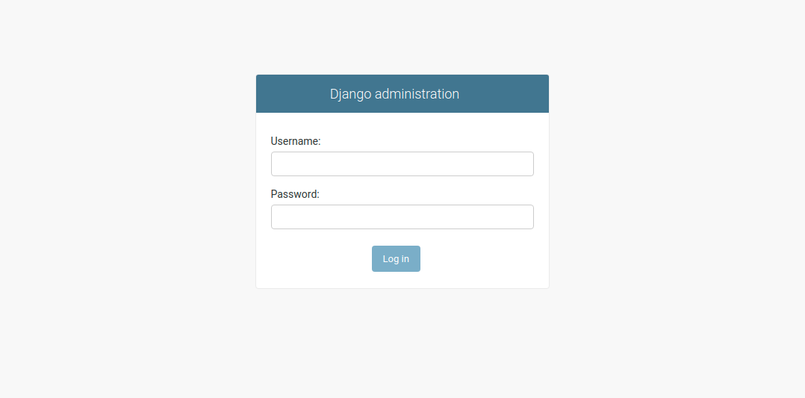
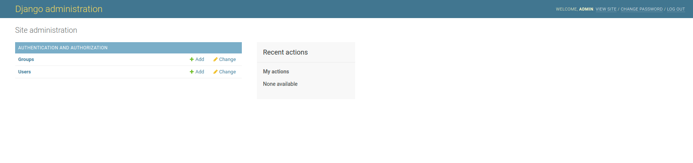
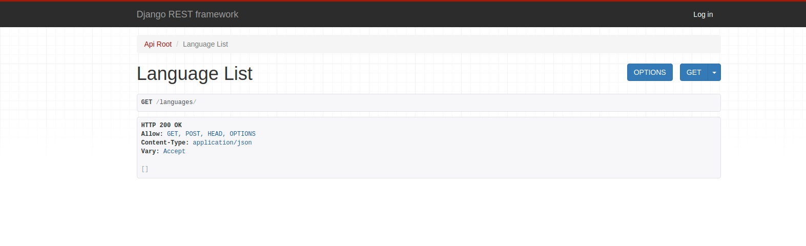
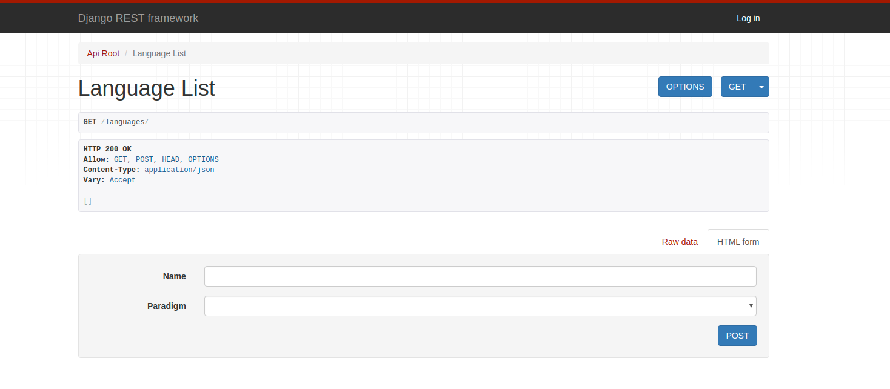

# Step-3 - Permissions

Django comes with a simple permissions system. It provides a way to assign permissions to specific views, users and groups of users.

First make sure that your virtual environment is active : `pipenv shell`.

1. Check `tutorial/api/urls.py` it should have the following.

```
urlpatterns = [
    ...
    path('api-auth', include('rest_framework.urls'))
]
```

2. Create a superuser account.

```
(tutorial) dev-mentor@devmentor-PC-MK34LEZCBEAD:~/Downloads/tutorial$ python manage.py createsuperuser --email admin@example.com --username admin
Password: 
Password (again): 
Superuser created successfully.
```

3. Start django server.

```
python manage.py runserver
```

4. Navigate to `http://127.0.0.1:8000/admin/` and enter your created login credentials.

Login Panel



Admin Dashboard 




### Permissions

There are two common permissions that we can use in django rest framwork these are. 

1. **Individual views** = Can set for every `individual` class view objects. 

2. **Global settings** = Can set globaly under `settings.py`.


## Types

1. **IsAuthenticatedOrReadOnly** = Can view rest api even NOT AUTHENTICATED Can view form if AUTHENTICATED.

2. **IsAuthenticated** = Can view both rest api and form if AUTHENTICATED.

### Steps

We will guard our individual **LanguageView** with `permissions.IsAuthenticatedOrReadOnly`.

1.) Import permissions `from rest_framework import permissions`.

2.) Below class `LanguageView` add **permission_classes = (permissions.IsAuthenticatedOrReadOnly,)**.

```
# tutorial/languages/views.py

from django.shortcuts import render
from rest_framework import viewsets, permissions
from .models import Language, Paradigm, Programmer
from .serializers import LanguageSerializer, ParadigmSerializer, ProgrammerSerializer

class LanguageView(viewsets.ModelViewSet):
    queryset = Language.objects.all()
    serializer_class = LanguageSerializer
    permission_classes = (permissions.IsAuthenticatedOrReadOnly,)

class ParadigmView(viewsets.ModelViewSet):
    queryset = Paradigm.objects.all()
    serializer_class = ParadigmSerializer

class ProgrammerView(viewsets.ModelViewSet):
    queryset = Programmer.objects.all()
    serializer_class = ProgrammerSerializer
```

Example of a **NOT** protected view. 



Example of a protected view using `permission_classes = (permissions.IsAuthenticatedOrReadOnly,)`




### Global settings

We can also set `global` permissions under `tutorial/api/settings.py` like example below.

```
REST_FRAMEWORK = {
    'DEFAULT_PERMISSION_CLASSES': (
        'rest_framework.permissions.IsAuthenticatedOrReadOnly',
    )
}
```

### Reference 

https://www.django-rest-framework.org/api-guide/permissions/

### Next

[step4: Jason Token](https://github.com/boomcamp/django-restframework/tree/step4-jwt).

