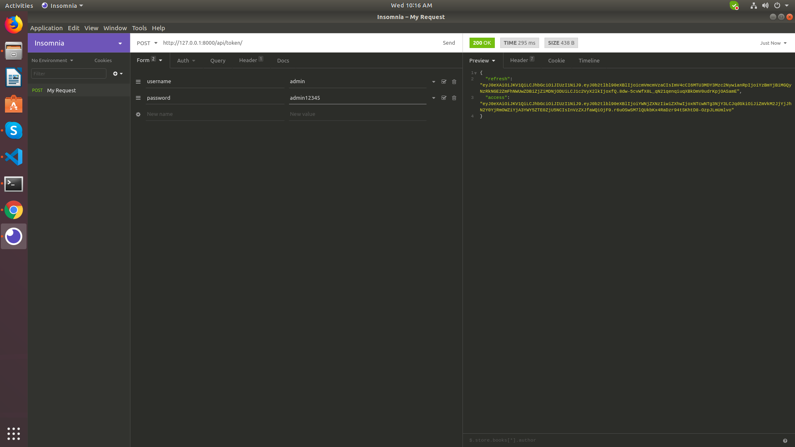
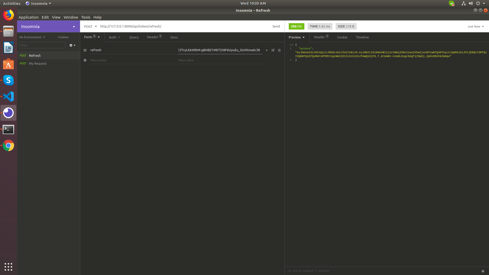

# Json Web Token(JWT)

We're going to produce token's for our `api` project.

1. First we need to install a library called `djangorestframework_simplejwt` into our virtual environment.

```
(tutorial) dev-mentor@devmentor-PC-MK34LEZCBEAD:~/Downloads/tutorial$ pipenv install djangorestframework_simplejwt
Installing djangorestframework_simplejwt…
Adding djangorestframework_simplejwt to Pipfile's [packages]…
✔ Installation Succeeded 
Pipfile.lock (271d0b) out of date, updating to (0bbb1b)…
Locking [dev-packages] dependencies…
Locking [packages] dependencies…
✔ Success! 
Updated Pipfile.lock (271d0b)!
Installing dependencies from Pipfile.lock (271d0b)…
  🐍   ▉▉▉▉▉▉▉▉▉▉▉▉▉▉▉▉▉▉▉▉▉▉▉▉▉▉▉▉▉▉▉▉ 7/7 — 00:00:02
```

2. Update `REST_FRAMEWORK` under `tutorial/api/settings.py` with these code.

```
REST_FRAMEWORK = {
    'DEFAULT_PERMISSION_CLASSES': (
        'rest_framework.permissions.IsAuthenticated',
    ),
    'DEFAULT_AUTHENTICATION_CLASSES': (
        'rest_framework_simplejwt.authentication.JWTAuthentication',
    )
}
```

4. Under `tutorial/api/urls.py` we need to import `TokenObtainPairView, TokenRefreshView`.

```
...
from rest_framework_simplejwt.views import TokenObtainPairView, TokenRefreshView
```

and update the **urlpatterns** with these code.

```
urlpatterns = [
    ...
    path('api/token/', TokenObtainPairView.as_view()),
    path('api/token/refresh/', TokenRefreshView.as_view())
]
```

We should now have this final code:

```
from django.contrib import admin
from django.urls import path, include
from rest_framework_simplejwt.views import TokenObtainPairView, TokenRefreshView

urlpatterns = [
    path('admin/', admin.site.urls),
    path('', include('languages.urls')),
    path('api-auth', include('rest_framework.urls')),
    path('api/token/', TokenObtainPairView.as_view()),
    path('api/token/refresh/', TokenRefreshView.as_view())
]

```

5. We are also going to use [insomnia](https://insomnia.rest/download/) or any REST gui client you may want.

```
(tutorial) dev-mentor@devmentor-PC-MK34LEZCBEAD:~/Downloads/tutorial$ sudo snap install insomnia
```

### Endpoints

1. Providing a token.

```
endpoint: http://127.0.0.1:8000/api/token/
method: POST
body:
    form-urlencoded: 
        username: admin, 
        password: black0Z12345
```

Token:



It will generate two tokens which are `refresh` and `token` json encoded values.

2. Requesting a new token.

```
url: http://127.0.0.1:8000/api/token/refresh/
method: POST
body:
    form-urlencoded:
        refresh: REFRESH_TOKEN
```

Referesh token:




After generating token(s) we should now have an access on these endpoints.

```
http://127.0.0.1:8000/paradigms/
http://127.0.0.1:8000/languages/
http://127.0.0.1:8000/programmers/
```

Example response:

```
url: http://127.0.0.1:8000/paradigms/
method: GET 
type: 
    Autorization
    bearer: YOUR_TOKEN
```

after sending the request you should see a response like:
```
{
    "id": 1,
    "url": "http://127.0.0.1:8000/paradigms/1/",
    "name": "functional"
},
{
    "id": 2,
    "url": "http://127.0.0.1:8000/paradigms/2/",
    "name": "procedural"
},
{
    "id": 3,
    "url": "http://127.0.0.1:8000/paradigms/3/",
    "name": "object oriented"
}

```

### Pre-reading

[Access Tokens and Refresh Tokens and ID Tokens](https://winsmarts.com/access-tokens-and-refresh-tokens-and-id-tokens-5261bc26e8a2).

### Alternatives

[Token Authentication](https://www.django-rest-framework.org/api-guide/authentication/#tokenauthentication)

# Next

[Re activating our existing virtual environment](https://github.com/boomcamp/django-restframework/tree/step5-tutorial)

