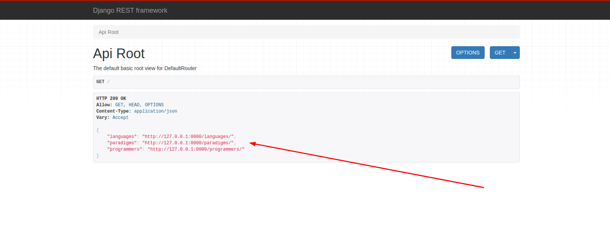

# Step-2 basic ORM

The goal of step-2 basic orm is to have basic understanding for django models

Example : paradigms > languages > programmers.

What is **ORM** = Object-relational mapping (ORM) is a programming technique in which a metadata descriptor is used to `connect object code` to a `relational database`.

Below are example of an ORM.

1. Update tutorial/languages/`models.py` with the code below.

```
from django.db import models

class Paradigm(models.Model):
    name = models.CharField(max_length=50)

    def __str__(self):
        return self.name

class Language(models.Model):
    name = models.CharField(max_length=50)
    paradigm = models.ForeignKey(Paradigm, on_delete=models.CASCADE)

    def __str__(self):
        return self.name


class Programmer(models.Model):
    name = models.CharField(max_length=50)
    languages = models.ManyToManyField(Language)

    def __str__(self):
        return self.name
```

2. Update tutorial/languages/`serializers.py` with the code below.

```
from rest_framework import serializers
from .models import Language, Paradigm, Programmer

class LanguageSerializer(serializers.HyperlinkedModelSerializer):
    class Meta:
        model = Language
        fields = ('id', 'url', 'name', 'paradigm')

class ParadigmSerializer(serializers.HyperlinkedModelSerializer):
    class Meta:
        model = Paradigm
        fields = ('id', 'url', 'name')

class ProgrammerSerializer(serializers.HyperlinkedModelSerializer):
    class Meta:
        model = Programmer
        fields = ('id', 'url', 'name', 'languages')
```


3. Update tutorial/languages/`urls.py` with the code below.

```
from django.urls import path, include
from . import views 
from rest_framework import routers 

router = routers.DefaultRouter()
router.register('languages', views.LanguageView)
router.register('paradigms', views.ParadigmView)
router.register('programmers', views.ProgrammerView)

urlpatterns = [
    path('', include(router.urls))
]
```

4. Update tutorial/languages/`views.py` with the code below.

```
from django.shortcuts import render
from rest_framework import viewsets
from .models import Language, Paradigm, Programmer
from .serializers import LanguageSerializer, ParadigmSerializer, ProgrammerSerializer

class LanguageView(viewsets.ModelViewSet):
    queryset = Language.objects.all()
    serializer_class = LanguageSerializer

class ParadigmView(viewsets.ModelViewSet):
    queryset = Paradigm.objects.all()
    serializer_class = ParadigmSerializer

class ProgrammerView(viewsets.ModelViewSet):
    queryset = Programmer.objects.all()
    serializer_class = ProgrammerSerializer
```

6. Re-update migrate tables and serve.

```
python3 manage.py makemigrations
python3 manage.py migrate 
python3 manage.py runserver
```

Output: 

```
(tutorial) dev-mentor@devmentor-PC-MK34LEZCBEAD:~/Downloads/tutorial$ python3 manage.py makemigrations
Migrations for 'languages':
  languages/migrations/0002_auto_20191008_0906.py
    - Create model Paradigm
    - Alter field paradigm on language
    - Create model Programmer

(tutorial) dev-mentor@devmentor-PC-MK34LEZCBEAD:~/Downloads/tutorial$ python3 manage.py migrate 
Operations to perform:
  Apply all migrations: admin, auth, contenttypes, languages, sessions
Running migrations:
  Applying languages.0002_auto_20191008_0906... OK


(tutorial) dev-mentor@devmentor-PC-MK34LEZCBEAD:~/Downloads/tutorial$ python3 manage.py runserver
Watching for file changes with StatReloader
Performing system checks...

System check identified no issues (0 silenced).
October 08, 2019 - 09:07:17
Django version 2.2.6, using settings 'api.settings'
Starting development server at http://127.0.0.1:8000/
Quit the server with CONTROL-C.
```

7. You can insert new records in this sequence.

```
paradigms > languages > programmers
```

Root 



Paradigms 


Languages 


Programmers


### Resources ORM

[Django ORM Relationships Cheat Sheet](https://hackernoon.com/django-orm-relationships-cheat-sheet-14433d6cf68c)
